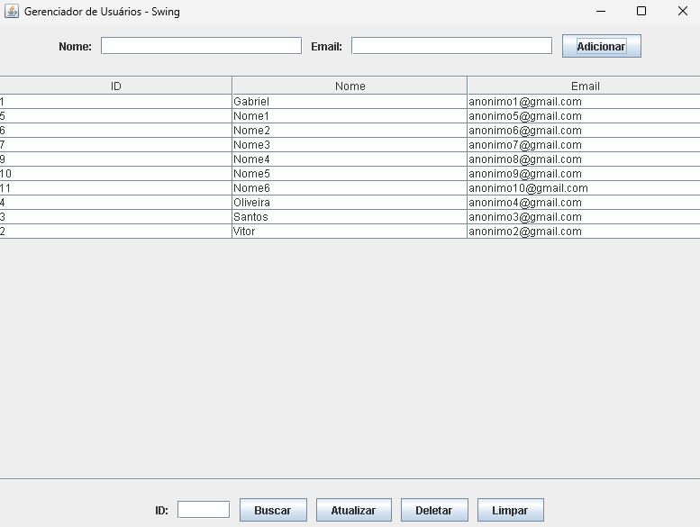
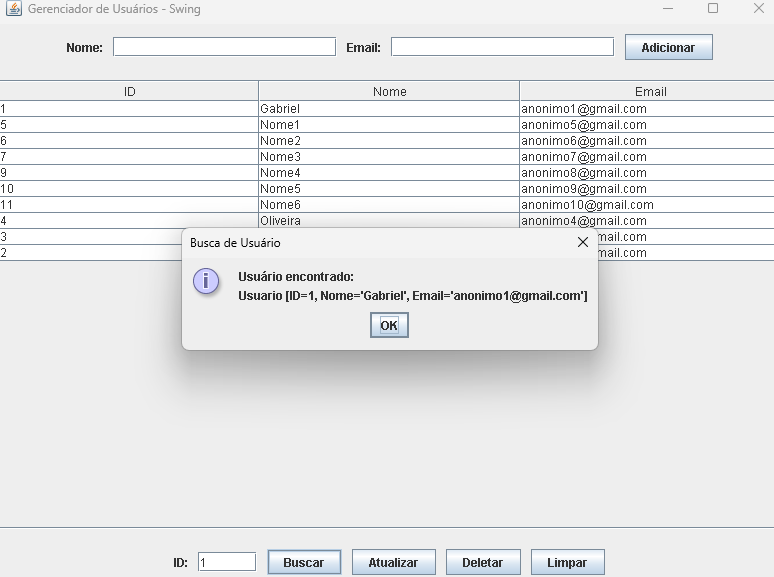
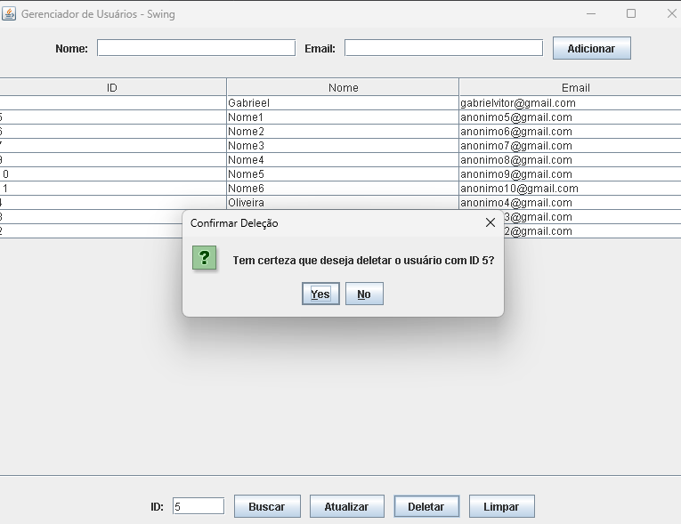
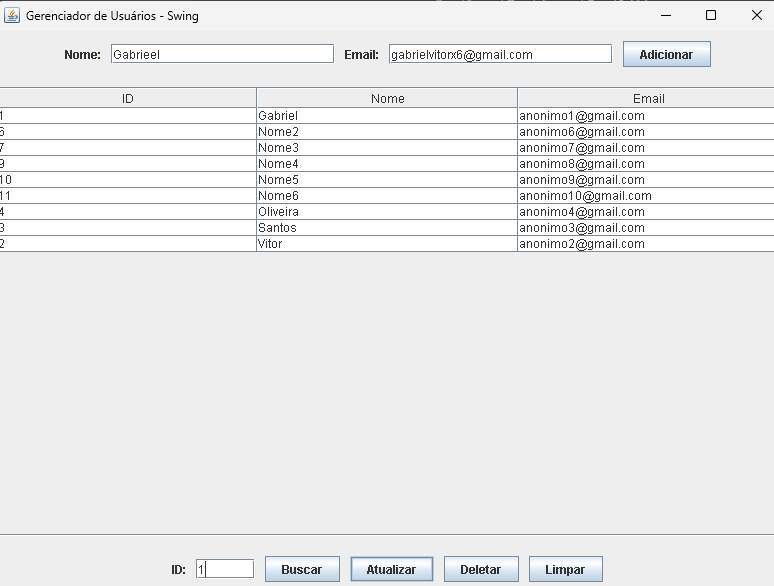
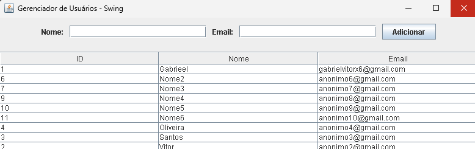

# 👥 Gerenciador de Usuários - JDBC com PostgreSQL e Swing

### Sobre o Projeto

Este projeto é uma aplicação de desktop simples, desenvolvido em Java com a biblioteca **Swing**, que demonstra a implementação de um sistema **CRUD** (Create, Read, Update, Delete). Ele utiliza **JDBC** (Java Database Connectivity) para interagir com um banco de dados **PostgreSQL**, seguindo as melhores práticas de desenvolvimento, como o padrão **DAO** (Data Access Object).


### 🖼️ Como o Projeto Funciona (Visualização)

A interface gráfica é intuitiva e permite realizar todas as operações de CRUD de forma visual. Abaixo estão algumas capturas de tela das funcionalidades:

#### Tela Principal

A tela inicial exibe a lista de usuários que foram cadastrados e os campos para adicionar novos usuários.



#### Busca de Usuário por ID

Ao inserir um ID e clicar em "Buscar", a aplicação retorna os dados do usuário em um pop-up.



#### Deletando Usuário

Ao inserir um ID e clicar em "Deletar", a aplicação solicita uma confirmação para evitar deleções acidentais.



#### Atualização de Usuário

Você pode buscar um usuário e seus dados preencherão os campos, permitindo que você altere as informações.



#### Lista de Usuários Atualizada

A lista de usuários é atualizada dinamicamente após preencher e clicar em atualizar.



### 🛠️ Tecnologias Utilizadas

* **Linguagem:** Java 17+
* **Interface Gráfica:** Java Swing
* **Gerenciador de Dependências:** Maven
* **Conexão com Banco de Dados:** JDBC
* **Banco de Dados:** PostgreSQL 16+
* **IDE:** IntelliJ IDEA

### 📁 Estrutura do Projeto

A arquitetura do projeto foi pensada para ser clara e modular:

```plaintext
src/main/java/br/com/empresa/gerenciador/
├── dao/               # Data Access Objects (Lógica SQL)
│   └── UsuarioDAO.java
├── model/             # Classes de Modelo (Representação dos dados)
│   └── Usuario.java
├── util/              # Classes Utilitárias (Fábrica de Conexão)
│   └── ConnectionFactory.java
└── view/              # Interface Gráfica e Lógica de Eventos
    └── MainView.java
